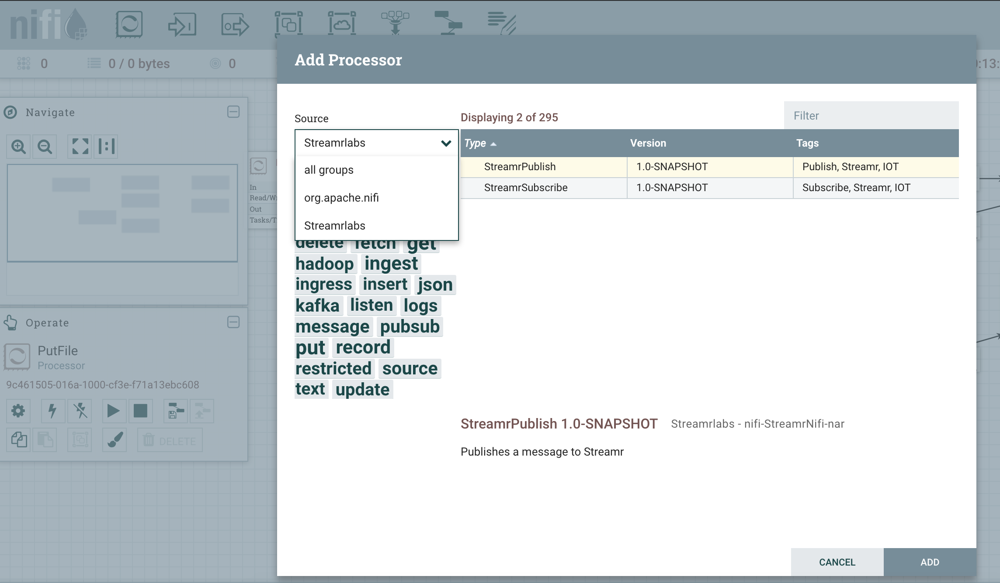
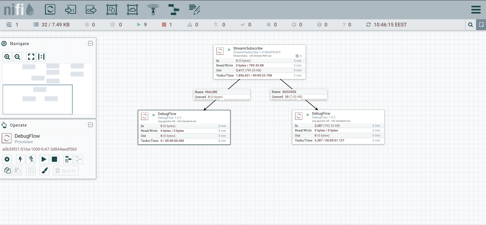
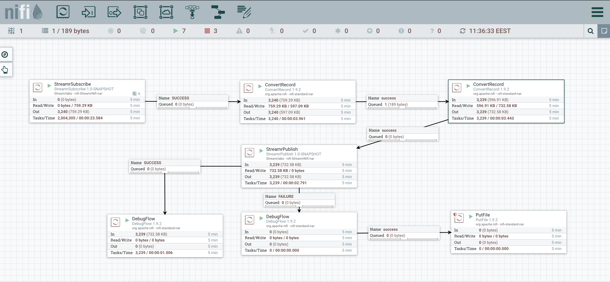

# Apache Nifi - Streamr Processors

[Apache NiFi](https://nifi.apache.org/) is a tool created to automate data flows between systems. This repository contains the source code and latest .nar files for Streamr publish and subscribe processors for NiFi.
This version of the processors is done with NiFi v1.9.2.

## Getting Started
If you do not have NiFi installed you can find the guide for how to do it [here](https://nifi.apache.org/docs/nifi-docs/html/getting-started.html#downloading-and-installing-nifi).

If you only wish to use the current version of the processors and not download or clone the entire repository, you can download the .nar file [here](./nifi-StreamrNifi-nar/target/nifi-StreamrNifi-nar-1.0-SNAPSHOT.nar). 

After you have cloned the repository or downloaded the .nar file you have two options to get started with the Streamr processors in NiFi. You can simply copy the .nar file to NiFi's `libexec/lib` directory. If you wish to develop the processors you should link the .nar file to NiFi's libexec/lib directory. 

`ln -s {STREAMRNIFI_HOME}/nifi-StreamrNifi-nar/target/nifi-StreamrNifi-nar-1.0-SNAPSHOT.nar {NIFI_HOME}/libexec/lib`

This way you do not need to update the .nar file to NiFi's directory every single time after compiling the processors. The code for the processors is found in [/nifi-StreamrNifi-processors/src/main/java/Streamrlabs/processors/StreamrNifi](./nifi-StreamrNifi-processors/src/main/java/Streamrlabs/processors/StreamrNifi). After making changes you should use the commands `mvn clean install` or `mvn compile` to compile the updated .nar file. 

## Using the processors

After the .nar file is added to the NiFi's /lib directory and you have restarted NiFi you should be able to use the Streamr processors. You can add new processors to the flow by dragging the add processor icon from the top left corner of the editor to the canvas. 

In the image above you can see an easy way to find the Streamr processors in the Add Processor module. Simply select Streamrlabs from the the Source drag down menu and the publish and subscribe processors should be displayed.

If you do not have a Streamr account or haven't yet set up a stream you can do these [Streamr's editor](https://www.streamr.com/canvas/editor). If you need help with setting up Streamr check out [this](https://medium.com/streamrblog/how-to-connect-data-to-streamr-in-5-minutes-1-of-3-9363afd254e6) blog post.

### Using the subsribe processor
After adding the subscribe processor to the flow you need to configure the stream you wish to subscribe to. This is done by first double clicking the processor, then going to the properties tab and lastly adding your Streamr API key and Stream ID to the properties. These can be found in Streamr's editor.

After the properties have been set up the processor should not work before you have either auto-terminated the relationships or connected them to nodes. It's important to note that the subscribe processor __does not allow any inputs__ and should instead be used as a starting point for a data flow.

In the picture above you can see a running example flow. After all processors are configured correctly you can simply click on the processor and click on the play button in the Operate module on the left side of the screen. The failure relationship is used if there are any problems when processing the data, otherwise the success relationship is used to push the data further down the flow. The data is sent forward in a one line JSON String format:

`{"field1": 1231, "field2": "example", "field3": [123, 223]}`

This format can be easily converted in to other formats by using the ConvertRecord processor found out of the box in NiFi. You should set up the controller service for reading input for the ConvertRecord to be JsonTreeReader. This allows you to convert the data into any form supported by the ConvertRecord processor.

### Using the publish processor
Similarly to the subscribe processor the publish processors properties have to be set up before the processor can run. 

The publish processor can be used as an end point to push flow data to Streamr or it can be used in the middle of a flow for ie. logging. The processor pushes the input data it has received to the failure and success relationships. When used as an endpoint you can choose to autoterminate the relationships or connect them to ie. DebugFlow processors to track the processors outputs.

The publish processor currently takes as its input a one line JSON string object similar to the subscribe processors output:

`{"field1": 1231, "field2": "example", "field3": [123, 223]}`

Using the ConvertRecord processor is again encouraged. You should set up the ConvertRecord processors write controller to be JsonRecordSetWriter. It is important to set up the controller to write out the JSON string one entry at a time in the controller's properties, as the processor cannot read lists of JSON objects.

## Example flow using both processors

